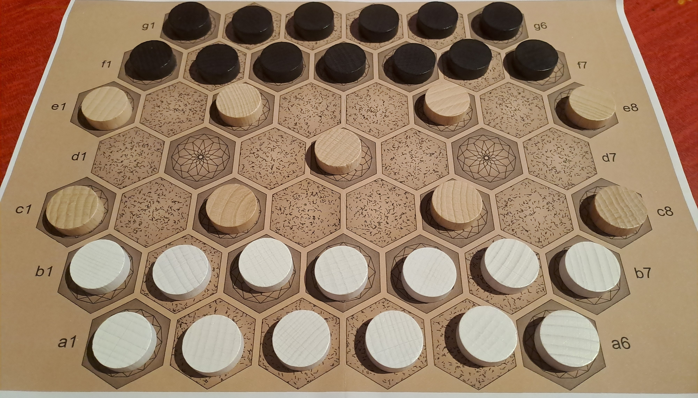

# Staku : rules of an abstract board game

In the game "**staku**", two players, White and Black, move their tokens, stacking and unstacking them in order to reach one of the opponent's two "palaces". Players will have to take advantage of neutral tokens, manage captures and "trampoline" effects on stacks of 2 or 3 tokens!

Number of players: 2 / Minimum age: 8 years / Game duration: 15 to 30 minutes

Game kind: goal win condition, stacking and capturing; abstract game

*This is a working project  : tests have not yet started !*

*Options : Staku-2 = max size of stack = 2 ; Staku-3 = max size of stack = 3*

---

Dans le jeu "**staku**", deux joueurs, Blanc et Noir, déplacent leurs jetons, les empilent et les dépilent afin d'atteindre l'un des deux "palais" adverses. Les joueurs devront tirer parti des jetons neutres, gérer les captures et les effets "trampoline" sur des piles de 2 ou 3 jetons !

Nombre de joueurs : 2 / Age minimum : 8 ans / Durée de la partie : 15 à 30 minutes

Type de jeu : condition de victoire par objectif, empilement et capture ; jeu abstrait

*Ceci est un projet en cours : les tests n'ont pas encore commencé !*

*Options : Staku-2 = taille max de pile = 2 ; Staku-3 = taille max de pile = 3*

## Copyright

 Copyright (C) 2024 Lucas Borboleta.

Staku, rules of a strategy game for two players, by Lucas Borboleta (https://github.com/LucasBorboleta/staku) is licensed under a Creative Commons Attribution-NonCommercial-ShareAlike 4.0 International License. To view a copy of this license, visit http://creativecommons.org/licenses/by-nc-sa/4.0/.

Permissions beyond the scope of this license may be available at [lucas.borboleta@free.fr](mailto:lucas.borboleta@free.fr).
